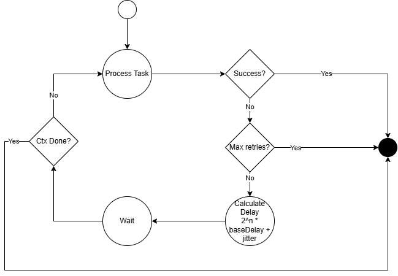

# Retry With Backoff

This package implements custom retry with backoff system, which receives a function to execute. The main attributes are:

### Retries 

Define the number of times that the operation should be retries 

### Base delay 

Initial delay to wait until retry the operation 

### Jitter 

Random number between 0 and base delay to avoid the [Thundering Herd Problem](https://en.wikipedia.org/wiki/Thundering_herd_problem)

To calculate the delay, the formula will be 

$$baseDelay * 2^n + random(0, baseDelay)$$

## Run the program 

The program can be executed in the main package by 

```
go run main.go [-retries n] [-jitter bool] [-timeout 10s] [-baseDelay 300ms] [-maxDelay 5s]
```

The performed operation will obtain a number between 0 and 15, and  if it is 0, it will succeed, otherwise, it will fail.

## Diagram 

