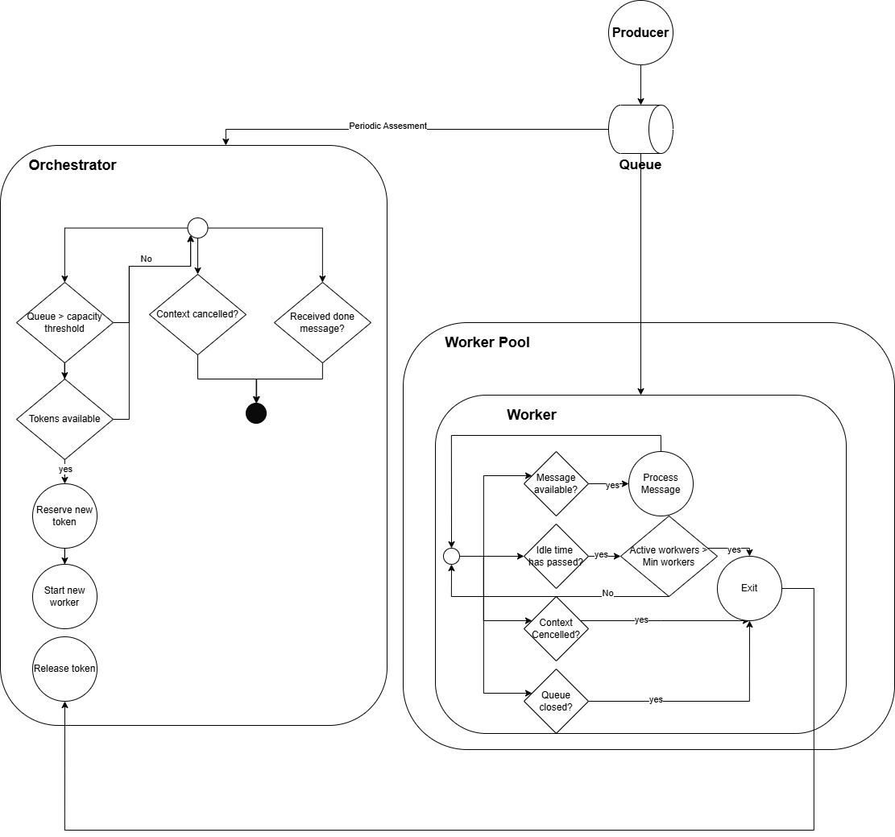

# Order Processor

This section represents an order processor which is being executed with a worker-pool pattern. 

The main components of the system are 

## Queue 

It is defined as a buffered channel with the maximum number of workers.

## Producer 

The producer will send messages in random intervals to see the sacling and downsizing of the system. It is a simple goroutine. In real systems, this producer could be an independent service 

## Worker 

The worker consumes messages from the queue, it has an indefinite *for* loop that is cancelled when the queue was closed or when the worker has been idle for a specified time and there are more workers than the minimum

## Orchestrator 

The main functionallity of the orchestrator is to start new workers depending on the queue pressure (defined as the number of messages in the queue). The system has a capacity threshold, and if it is exceeded, the orchestrator will start a new worker. 

To not exceed the maximum number of workers, the orchestrator uses a **semaphore**, defined as a buffered channels with the maximum number of workers as a capacity. When a new worker start, a token is assigned to it, and, when it finishes, the token is revoked. This number of tokens can be treated as the number of active workers.

## Channels 

### Queue 
Contains the messages to be processed

### Semaphore (Tokens)

Buffered channel which helps to enforce the maximum number of workers, it is helpful also to define responsibility (1 token is assigned to 1 worker)

### Done 

It is useful to notify the orchestrator when the queue was closed, so the orchestrator can exit early 

## Overview 

